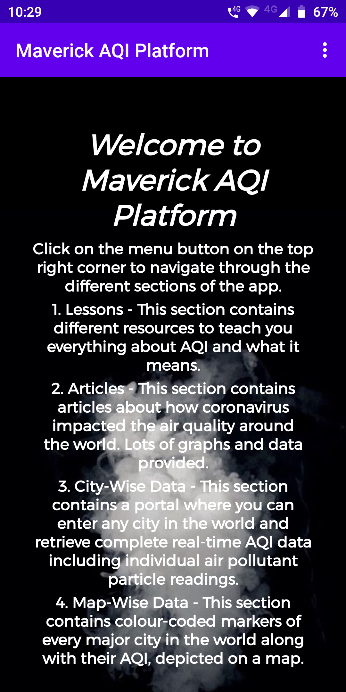

# maverick-aqi-platform
Android Studio project for AQI platform app developed by @mizanxali

Coronavirus has had a tremendous impact on air quality around the world. Levels of air pollutants over many countries are showing significant drops. <em>Air Quality Index (AQI)</em> is a metric which reflects the air pollution levels and hence a very good way to understand the impact of the lockdown. How amazing would it be if you had access to this information with a tap of your finger? Therefore I created an Android App platform which serves as a full-fledged guide to everything you need to know about AQI and its levels in cities around the globe. My app not only provides REAL-TIME CONSTANTLY UPDATED AQI and pollutant levels for cities in a search-directory fashion but also a provides a birds eye colour-coded world map view for AQI levels in all major cities. Not only that, there are a dozen of learning resources, articles, case studies, graphical data analysis and much more. This app is all you need to know about AQI and keep track of its levels around the world!

<h1>Use Cases</h1>
<ul>
<li>Real-time tracking of AQI levels in every city around the world</li>
<li>To view AQI levels in major cities around the world on a map</li>
<li>To learn everything about AQI, air pollution and pollutants</li>
<li>To look up and read articles, case studies and graphical analysis about impact of coronavirus on atmosphere</li>
</ul>

<h1>Dependencies</h1>
Air Quality Programmatic JSON API from aqicn.org

<h1>Social Impact Analysis with COVID19</h1>
Maverick AQI Platform helps users to understand the impact of the coronavirus/COVID19 on our atmosphere.
The app particularly emphasizes on the benefits of lockdown on the air quality, hence encouraging people to stay inside, which is the most important necessity to fight the pandemic.
Using data from around the entire world, it educates users on the above-mentioned subject.
This app is undoubtedly an extremely useful resource considering the global situation during the current times and I am very confident that it will make a huge difference to the world.

<h1>Screenshots</h1>

